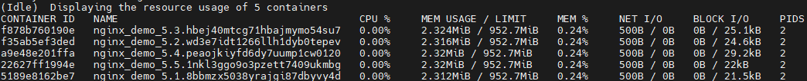

## Task 1: Evaluation of Startup Time

1 Replicates (0.925 sec)

5 Replicates (2.774 sec)

10 Replicates (4.977 sec)

## Task 2: Resource Usage
Resource usage of 1 containers

Resource usage of 5 containers

Resource usage of 10 containers

## Task 3: Load Balancing Efficiency
The result of load balancing
We have used locust.io to create a 100 user traffic/second to our server, 

The result of our 10 containers have average 1.5% of cpu usage,
and you can see from the graph, the traffic are balancely loaded between replicate.

## Task 4: Failure Recovery Time
Demostrate response time of starting a container when one is failed.

it takes 1s seconds for failure recovery of 1 containers
`
    1713885548-1713885547 = 1s
`

it takes 24s seconds for failure recovery of 5 containers
`
    1713886048-1713886045 = 3s
`

it takes 24s seconds for failure recovery of 5 containers
`
    1713885791-1713885783 = 8s
`

## Task 5: Auto Scaling
We didn't test here, since Auto Scaling is not originally provided by docker.
It is more difficult / complicate to do autoscaling compare to k8s/mesos.